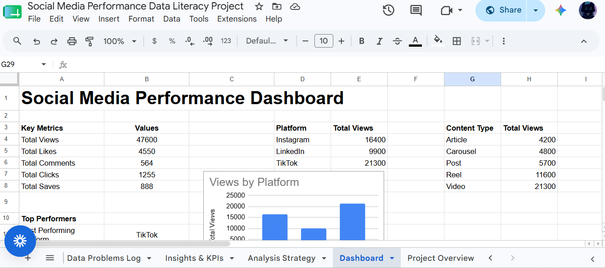

# Social Media Performance Data Literacy Project

## Project Overview

This project demonstrates the application of data literacy skills to organize, clean, analyze, and visualize social media performance data.

The purpose of this project was to transform raw data into meaningful insights that can support reporting, decision-making, and performance improvement.

## Project Objectives

- Organize raw social media performance data
- Create a structured data dictionary
- Identify and resolve data quality issues
- Clean and prepare data for analysis
- Calculate key performance indicators (KPIs)
- Build a dashboard to communicate insights

## Skills Demonstrated

- Data Literacy
- Data Cleaning
- Data Organization
- KPI Analysis
- Data Visualization
- Dashboard Creation
- Insight Generation

## Tools Used

- Google Sheets
- GitHub
- Data Analysis Techniques

## Project Workflow

### 1. Raw Data

Created a social media dataset containing:

- Date
- Platform
- Content Type
- Topic
- Views
- Likes
- Comments
- Clicks
- Saves

### 2. Data Dictionary

Created documentation describing each data field, including:

- Column names
- Data types
- Purpose of each field

### 3. Data Cleaning

Identified and corrected data quality issues including:

- Inconsistent platform naming
- Formatting inconsistencies
- Missing information
- Duplicate or incorrect entries

### 4. Data Analysis

Used KPIs and analysis methods to identify performance trends.

Key findings:

- Best Performing Platform: TikTok
- Best Performing Content Type: Video
- Highest Performing Topic: AI Tools

### 5. Dashboard Development

Created a dashboard displaying:

- Key performance metrics
- Performance summary
- Views by platform
- Views by content type
- Views by topic

## Project Screenshots

### Dashboard

### Data Problems Log

### Insights & KPIs

## Outcome

This project demonstrates the ability to transform raw information into organized data, actionable insights, and clear visual reports.

It represents practical experience in data organization, analysis, reporting, and creating systems that improve decision-making.

